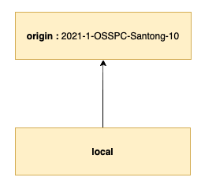
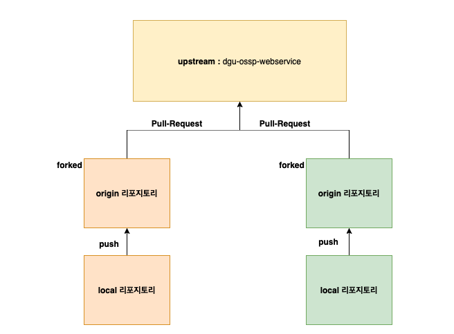

# Git Branch 전략 

- **2021-1-OSSPC-SanTong-10** (리포지토리)
  - main
- **dgu-ossp-webservice** (리포지토리)
  - main
  - work 
  - feature-____

**2021 OSSP 산통깨지마 팀** :

산통깨지마 팀은 크게 `AI 프로젝트 + 웹 서비스 프로젝트` 구조로 진행됩니다. 

___

**2021-1-OSSPC-SanTong-10** 리포지토리에서는 팀 설명, 회의록, 각 팀원의 공부 자료 등을 업로드하는 목적으로 활용합니다. 회의록 업로드의 경우에는 순번에 따라서 한 명씩 돌아가면서 작성 후 업로드하는 구조이고, 각 공부 자료는 디렉토리 별로 관리하므로 기본적으로 <u>충돌 가능성을 배제한 상태</u>로 관리할 수 있습니다. (단, 예외적으로 충돌 가능성이 있는 경우에는 추후 다시 논의 후 업데이트 하겠습니다.)

​																			 < 그림 1> 

<그림 1>과 같이 원격 리포지토리의 브랜치를 바라보고 있는 구조로 두고 관리합니다. https://git-scm.com/book/ko/v2/Git-%EB%B8%8C%EB%9E%9C%EC%B9%98-%EB%A6%AC%EB%AA%A8%ED%8A%B8-%EB%B8%8C%EB%9E%9C%EC%B9%98를 참고하시면 <그림 1> 구조에서 자주 사용되는 개념과 명령어를 참고할 수 있습니다. 업로드 되는 자료 특성 상 독립적이므로 PR(Pull Request) 또는 리뷰 관련 규칙을 정의하지는 않습니다. 

**커밋 메시지 작성 방식** : 

회의록의 경우에는 "회의록 : 회의 진행 일시"로 작성해주시면 됩니다. 예를 들어 "회의록 : 2021/04/29".  

___

**dgu-ossp-webservice** 리포지토리에서는 웹 서비스 소스 코드를 관리합니다. 프론트(유은), 백엔드(태권)이 참여하여 관리하게 됩니다. 동일한 프로젝트 내부에서 소스 코드 변경이 발생 (특히 설정 파일 관련해서) 하므로 충돌 가능성이 상대적으로 높을 수 있습니다. 

​												 <그림 2> 

전체적인 리포지토리 구조는 <그림 2>와 같습니다. 위와 같은 구조를 갖는 이유는 협업하는 상황에서 공유하고 있는 원격 브랜치로 직접적인 push를 막고 PR(Pull Request)를 통해 병합 전 소스 코드 리뷰 과정을 추가할 수 있기 때문입니다. 이를 통해 개발에 참여하고 있는 개발자들이 서로 공유하고 리포지토리의 소스코드를 보다 안정적으로 관리하는데 도움을 줄 수 있습니다. 

