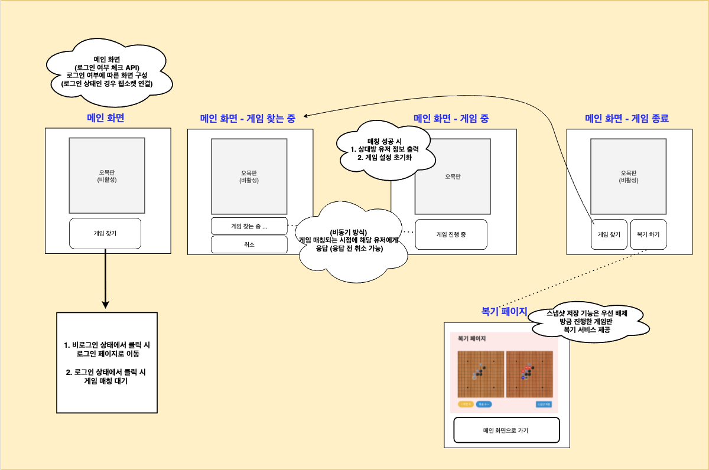

### | 게임 매칭 방식 : 랜덤 매칭 그리고 비동기 처리 

아래 <그림 1>에서 **게임 찾기** 버튼을 클릭 시, 해당 유저는 게임 찾기 대기 큐에 등록되고 해당 큐에 등록된 유저 중 랜덤하게 지정된 상대 유저와 오목 게임을 할 수 있다. 현재는 랜덤 방식으로 상대를 지정하지만, 승률 조건을 추가할 예정이다. (= '나'와 승률이 비슷한 유저와 매칭) 

​											 <그림 1> 

비동기 방식으로 게임 매칭 요청을 다루는 이유는 다음과 같다. 게임 진행을 위해 상대 유저가 반드시 필요한 구조이므로, 게임 매칭 요청 시 게임을 찾고 있는 유저가 없는 경우 게임을 진행할 수 없다. 이 때 매칭 요청에 대해서 동기적으로 처리하게 되면, 게임 매칭 성공 조건에 대한 불확실한 상황에서 (유저는 게임을 찾고 있는 상대 유저에 대한 정보를 알 수 없음)  게임 매칭 성공할 때 까지 계속해서 게임 찾기 요청을 보내야하는 구조가 된다. 

따라서, 게임 매칭 요청에 대해서 비동기 방식으로 처리하여 게임 매칭 성공이 되는 시점에 응답을 함으로써 위 문제를 해결할 수 있고, 클라이언트는 요청을 보낸 시점에서 서버의 응답을 기다리는 동안 다른 작업도 물론 가능하다 (= 게임 찾기 취소 등, Non-Blocking)

___

### | 게임 매칭 Flow :

1. **로그인**
   * 로그인 성공 시 메인 페이지로 이동
   * 메인 페이지에서 유저의 정보를 불러오기 위한 API 요청 
     * 유저 고유 ID 
     * 유저 닉네임
     * (유저 승률) --- 미정
2. **게임 찾기** 버튼 클릭 시 <그림 1> 오른쪽과 같이 **게임 찾는 중** 상태가 된다. 
   - 게임 매칭 전, 유저가 **취소** 버튼을 클릭하는 경우 : 다시 메인 화면으로 이동 
   - 게임 매칭을 유저의 요청 시간 기준으로 5분 경과 : 다시 메인 화면으로 이동 (예외 처리)
   - 서버 측 예외 상황 발생 : 다시 메인 화면으로 이동 (예외 처리)
3. **게임 매칭 성공 시**, 게임을 위한 초기화 진행 
   - 오목판 활성화
   - 어떤 유저가 흑(또는 백)인 지 안내 
   - 상대 유저 정보 (닉네임, 승률 등) 출력 
4. **게임 종료** 시점에 아래 두 옵션 
   - 게임 찾기 : 게임 종료 후 바로 게임 매칭 찾기 요청 
   - 복기 하기 : 종료된 게임에 대한 복기를 할 수 있는 페이지로 이동 