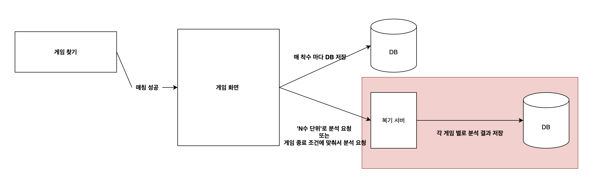
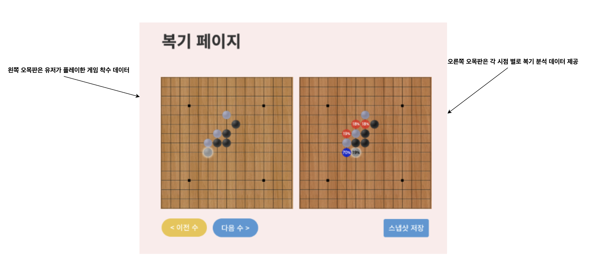

# 인 게임 데이터 및 복기 분석 데이터 저장 흐름

우선, 기존 협의 내용 중, **유저가 요청한 게임에 대해서만 복기 서비스를 제공**하는 것에서 유저가 진행한 **모든 게임에 대해서 복기 서비스를 제공**할 수 있도록 변경한다는 전제로 아래와 같은 데이터 저장 흐름을 설계했습니다. 

인 게임 내에서 유저가 착수하게 되면, 매 착수 마다 **DB**에 유저가 놓은 위치에 대한 좌표를 저장합니다. 또한 N수 단위로 복기 서버에 요청을 보내 복기 분석 데이터를 **DB**에 저장합니다. 

현재, 특정 시점에서 분석 요청을 보냈을 때 분석 시간이 대략 1~2초가 소요되므로, 모든 경기에 대해서 일괄적으로 처리하는 것보다 분기별로 나눠서 요청을 보내는 것이 더 효율적입니다. 분기 N은 실제 처리 시간에 따라서 다르게 적용할 예정입니다. 우선 디폴트 값은 4입니다.  (= 4수 단위로 분석 요청 & 분석 결과 DB 저장)

<그림 1>

우선, 데이터 분석이 우선적으로 작업되어야 하므로 현재는 <그림 1>과 같은 흐름으로 데이터를 처리하는 것으로만 알고 계시면 될 것 같습니다. 게임 화면에서 복기서버로 분석 요청을 보낼 때 요청 양식에 대해서는 변경 사항이 있는 경우 정리해서 다시 공유해주시면 됩니다. 

<그림 2> 

<그림 1>과 같은 흐름으로 데이터를 저장한 뒤, **복기 페이지** 에서는 <그림 2>와 같이 활용할 수 있습니다. <그림 2>에서 왼쪽 오목 판은 해당 게임 내에서 진행한 착수 데이터를 단순히 출력해주는 부분이고, 오른쪽 오목판은 왼쪽 오목판 시점에서 분석된 데이터를 출력합니다.

복기 페이지에 접근했을 때, 첫 번째 수부터 출력할 것인 지 가장 마지막 수부터 출력할 것인지는 옵션으로 선택할 수 있게 할 수 있습니다. 스냅샷을 저장한 경우 해당 게임 대전 기록 리스트에서 해당 사진 정보를 확인할 수 있도록 설계했습니다. (유은씨께서 복기 페이지 유아이 작업하실 때 <그림 2> 참고하셔서 진행해주시면 됩니다.)

<그림 2>와 같은 형태로 두 오목판을 두는 것에 대해서는 논의가 필요한 부분이니 적극적으로 피드백 부탁드립니다. 

 

