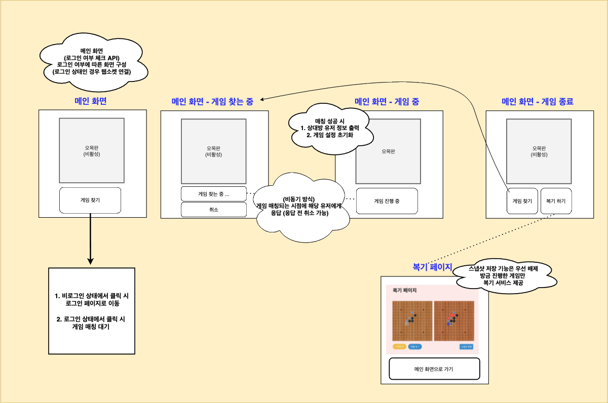

# 13주차 진행 사항

## | 윤태권 (백엔드)

### **서비스 Flow 정리 및 구현 중** 

<그림 1> https://github.com/CSID-DGU/2021-1-OSSPC-SanTong-10/blob/main/TK/Service%20FLOW%20via%20Async.md

### 진행 사항 : 

1. 비동기 처리 예제 프로젝트를 통해 비동기 방식으로 게임 매칭 처리 테스트 --- 게임 매칭 알고리즘에 적용해서 구현 할 예정
   - 유저의 **게임 찾기** 요청을 비동기 처리, 매칭 성공 시점에 응답하는 구조
   - 유저의 **게임 찾기** 요청을 비동기 처리, 지정한 처리 시간 초과하는 경우 또는 예외 발생하는 경우 예외처리  
2. Spring에서 제공하는 WebSocket 예제를 통해서 웹소켓 기반으로 서버에 연결된 클라이언트 간 메시지 전송/수신 테스트
   - 게임 중, 각 유저가 착수한 데이터 통신에 적용 예정
3. 게임 찾기 요청 시, Redis 서버에 저장 (**게임 찾는 유저 실시간으로 관리 목적**) 

___

### 진행 예정 : 

1. 게임 매칭 알고리즘 설계 & 구현 
2. 관련 API 문서 작성 후 클라이언트 측에 공유 

### 

