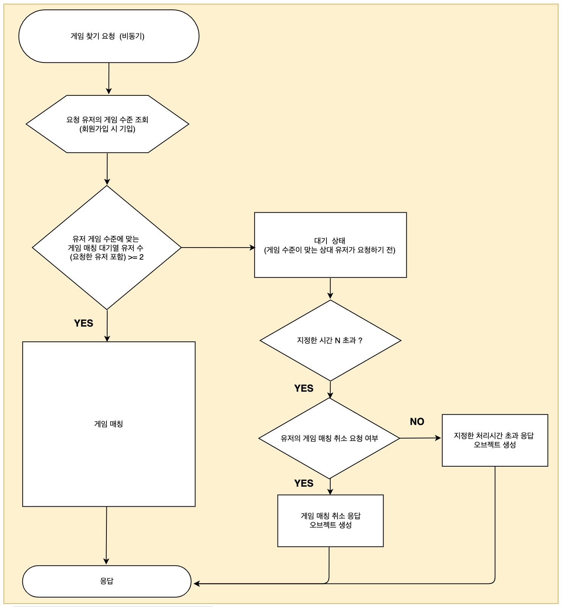
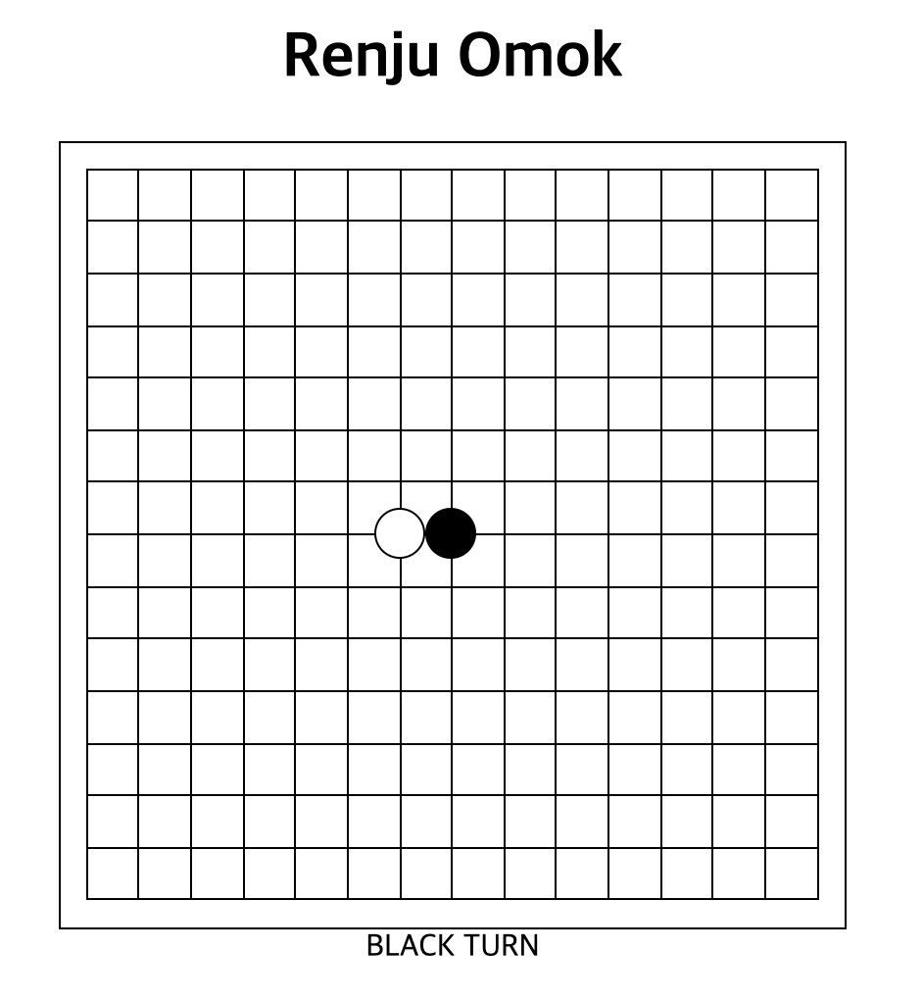
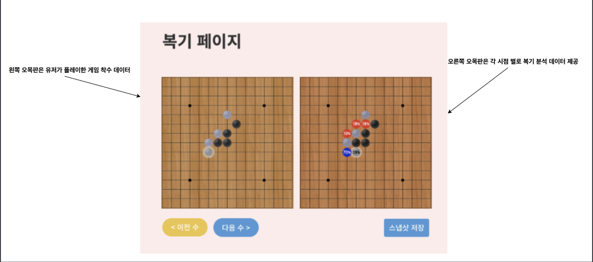

# 14 주차 진행사항 (프로젝트 중간 발표)

1. 게임 매칭 알고리즘 설계 및 구현 (90% 정도 작업), API 문서 제작, 예외 처리 부분 잔업으로 남아 있는 상태

2. 게임 매칭 성공 전제 (목 / 금 / 토) 

   1. 각 유저가 착수한 데이터를 송/수신 (웹소켓 기반)

      

   2. 데이터베이스에 게임 데이터 저장 (아래 왼쪽 오목판에 표시할 데이터) 

      

   3. [With 용희] 

      1. 요청 처리하는 서버 형태로 구축 어떻게 할 예정인 지, 분석 중 데이터베이스 환경 논의. (MySQL 저장 시, AWS 인스턴스에 있는 DB 서버 연동 정보 공유) 또는 다른 데이터베이스 형태로 저장해야 하는 지 논의. 
      2. API 문서 형태로 오목 데이터 요청 어떻게 하면 될 지 (https://github.com/CSID-DGU/2021-1-OSSPC-SanTong-10-webapp/blob/develop/REST%20API%20DOCS/Auth/Login%20API.md 참고)
      3. **복기결과를 어떤 형식으로 저장할 지 설계 후 공유 (to 용희)**

   4.  클라이언트 작업 

      딜레이 되고 있는 작업에 대해서는 개입 할 예정. 정리되는대로 용희님께 공유