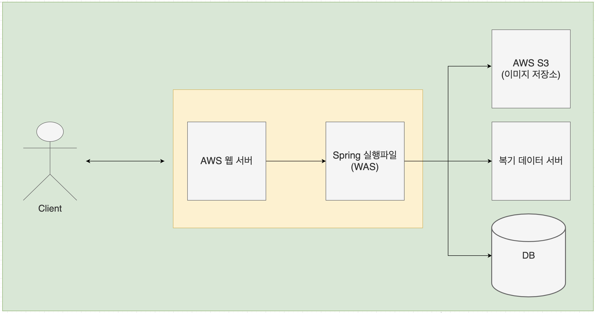

# **2021-04-29  금요일 2시 회의록**

## 메인 회의 내용 정리

- **일요일 자정까지 진행한 내역 정리해서 공유하기** 
- **UI 및 1차 기능 정하기** 
  - 더 구현할 수 있는 기능에 대해서는 2차로 구분하고, 우선적으로 가장 메인이 되는 기능을 정의하고 집중하기 
- **전체 프로젝트 구조도 관련 논의** 

**정용희 - 팀장, AI**

- 기존 오픈 소스에서 제공된 학습데이터에 추가 학습 데이터 확보 후 학습 진행 중 

**윤태권 - 벡엔드**

- 전체 프로젝트 구조도 작성 및 공유 

- 서버 환경 구축 관련 설계 및 다음 주 월요일 전까지 환경 구축 예정 

**신유은 - 프론트엔드**

- 웹 소켓 기반 단순 채팅 기능 관련 피드백 관련해서 다른 방안 아이디어 설계 
  - 유저가 오목 수을 놓기 까지의 제한된 시간을 연장할 수 있는 아이템 
  - 친구 또는 검색된 유저에 대해서 선물할 수 있는 기능
- 전체 프로젝트 페이지 단위의 구조도 작성 중 
- 전체 프로젝트 중 우선적으로 메인 페이지에 대해서 프로토타입 제작 중 

